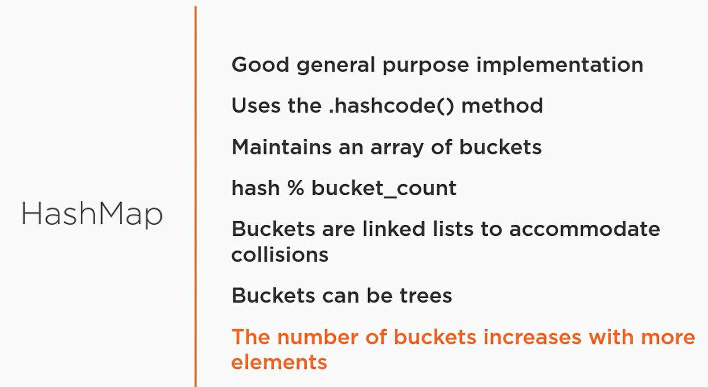

<h1>Maps</h1>

<a href="README.md">&lt;&lt; README </a>

- Is the only collection that does not implement the collection interface
- Collections of Pairs :
  - Have keys and values
    
        * Keys are unique
        * Values don’t have to be unique

<h2>Key feature</h2>

- Add or replace value :

  - `put(key, value), putAll(Map values)`: 
      
- Looking up element :
    -  `get(key)`  --> return null if key does not exist
       
    - `containKey(key)`  --> Boolean

    - `containValue(value)`  --> Boolean
  
- Removing :
    -  `Remove(key)` --> return the removed value 
       
- Remove all :
    - `clear() `

- Size :

    - `size()`
  
- Check if empty :
		
    - `isEmpty()`
    

<h2>use cases</h2>

- Getting all the keys :
  - My_map.`keySet()` --> return a set
- Getting all the values :
  - My_map.`values()` --> return a collection
- Returning all the (key, value) pair :
  - My_map.`entrySet()`
    - _Return type_ :
	  - _Set(Map.Entry<Key, value>)_
  

<h2>Java 8 enhancement (features added after java 8)</h2>

- `replace`(key, value)
  - Replacing a value if the key exists
    - Return the old value
- `replaceAll`():
  - Replacing using a function
   `` - Take : Bi function on :
      - the Key and the old value
- `remove`(key, value)
  - Remove a key if it has a certain value :
- --------------------
- `getOrDefault`(key):
  - Return the default value instead of null if no value exists
- `computeIfAbsent` :
  - Takes a key and function :
    - Return the value if it there
    - Compute a value if it is not there and put in the map
- `computeIfPresent`:
  - Takes a key and function :
    - If the value exists :
      - Update it with the computed value
    - Otherwise, do nothing
- `putIfAbsent` :
  - Puts a value if it is not in the map already
- `compute` :
  - If the value exists return it 
  - If not return null
    - _then update using the value returned from the function_
- --------------------
- `merge` :
  - Takes :
    - Key , value, remapping function
      - If there is no value for the key in the map :
        - Uses the new value
      - If a value exists :
        - The merge function Is called on the old, and the new value
- --------------------
- `forEach` :
  - Iterate through the map and pass the kay, and the value to your callback function
- --------------------

<h2>Implementations :</h2>
- **HashMap** :
  - Good general purpose implementation

- 

- **TreeMap** 
  - Define sort order and adds functionality
    
  - Use a red/black tree (balanced binary tree)
  - in general :
    - Slower than hash map
  - Provide functionality that hash map don’t :
    - _Implement the stored and navigable interfaces_

<table>
<tr>
<th>Operation</th>
<th>Put</th>
<th>Get</th>
<th>containKey</th>
<th>Next (iteration)</th>
</tr>

<tr>
<td>Hash Map</td>
<td>O(N) but Ω(1)</td>
<td>O(N) but Ω(1)</td>
<td>O(N) but Ω(1)</td>
<td>O(capacity/N) _capacity --> size of the backing array_</td>
</tr>

<tr>
<td>Tree Map</td>
<td>O(log(N))</td>
<td>O(log(N))</td>
<td>O(log(N))</td>
<td>O(log(N))</td>
</tr>

</table>

<a href="README.md">&lt;&lt; README </a>

