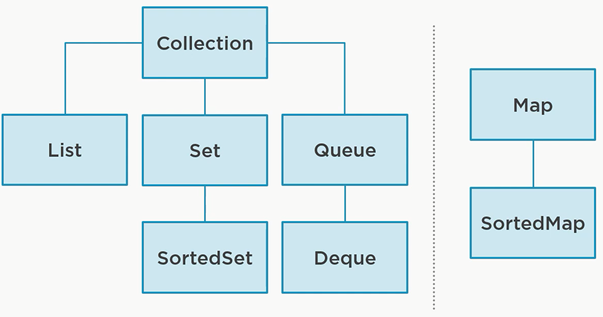

<h1 >Java Collections Framework</h1>
<ol>
<li>

[Lists](List.md)
</li>
<li>

[Maps](Map.md)
</li>
<li>

[Streams](Stream.md)
</li>
<li>

[Factories](Factory.md)
</li>
</ol>

<h2>Arrays</h2>

    - Arrays are a low level construct

    - Reasonable enough to have in the core language
      
    - Not flexible enough for use cases
      
    - (in java) Arrays are fixed length and not resizable
        
    - To resize an array :
              **Arrays.copyOf(arr, length + i)**
              

<h3>the structure of the collection framework</h3>

<h3>the interface and the actual implementation of the collection framework</h3>

<h3>implementation of the collection framework</h3>

<h3> How to choose a collection </h3>
- Are your elements keyed ?

   Yes :

        Is order important :

            Yes :

                sortedMap

            No :

                Map

  No :

        Elements must be unique :

            Yes :

                Order important ?

                    Yes :

                        Order Set

                    No :

                        Set

            No :

                Insertion order matter ?

                    Yes :

                        Deque

                    No :

                        List

<h4>flowchart for the process</h4>

<h3>Collection Behavior</h3>

- **The Collection interface extend the iterable interface**

- _**Methods**_ :
  - `size()` :
    
     get the number of element in the collection
    
  - `isEmpty()` :
    
     Return true if the collection is empty
    
  - `add()` :
    
      Add the element to the collection if it is not there
    
  - `addAll()`:
    
    Add all the elements of a given collection to the collection
    
  - `remove()`:
    
    Remove an element from the collection
    
  - `removeAll()`:
    
    remove all the elements of a given collection to the collection
    
  - `clear()`:
    
    Remove all elements in the collection
    
  - `retainAll()`:
    
    remove all the elements of the collection that is not in  the given collection
    
  - `contain()`:
    
    True if the element is in the collection
    
  - `containAll()`:
    
    True if all the elements in the given collection are in the collection
    

<ol>
<li>

[Lists](List.md)
</li>
<li>

[Maps](Map.md)
</li>
<li>

[Streams](Stream.md)
</li>
<li>

[Factories](Factory.md)
</li>
</ol>